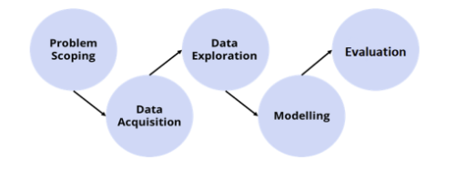
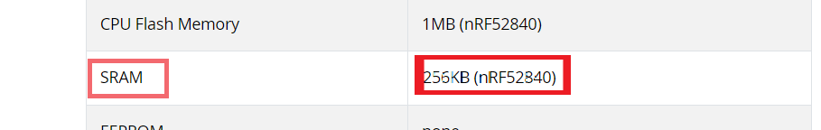
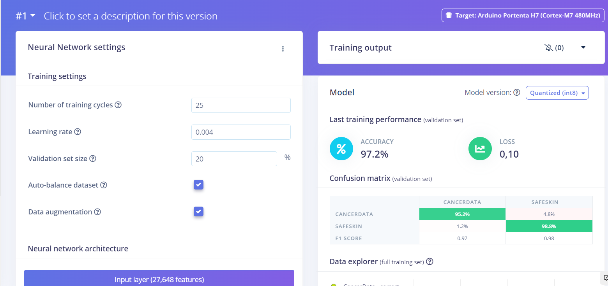
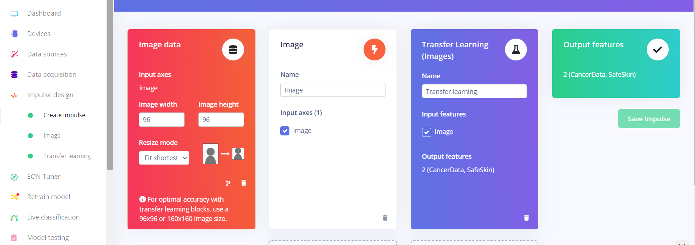
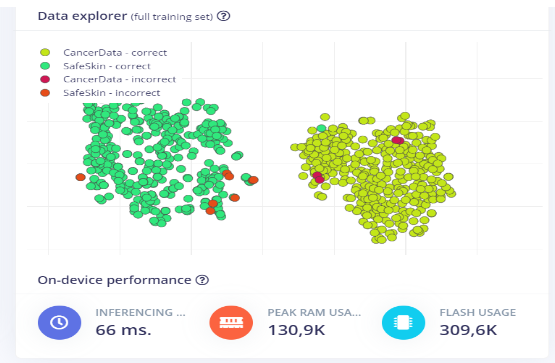
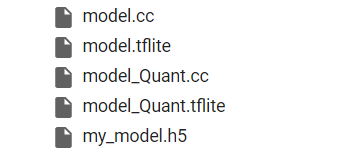
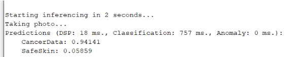

# Skin Cancer Detection Project TinyML

# 1. Introduction :
Using Arduino, the Nano 33 Sense BLE card and the camera module provided , the main objective of this project is realizing a binary image classification for skin cancer detection.
This project follows the AI/ machine learning  lifecycle presented below : 

# 2. Data acquisition : 

Creating the dataset is the most important part of the project , for the cancer images we used the website  kaggle, i used the images related to a specific skin cancer which is “melanoma” found in the website Kaggle.
https://www.kaggle.com/datasets/nodoubttome/skin-cancer9-classesisic
here we have 2 classes , labeled “SafeSkin” and “CancerData”
# 3. Model's choice : 
lots of models are used for image classification,
One main criteria for choosing the right model in tinyML is the size of the model , by size i mean the Peak Memory Usage of the model and its compatibility with the board used.
When building mobile, on-edge, or embedded recognition applications, there is typically a small amount of memory   available. 
If the recognition algorithm requires an extensive amount of RAM to perform enrollment and matching, then this could increase the hardware costs or, in the case of many embedded applications, wholly prevent the concept. 
let's take a look at the arduino BLE sense 33 datasheet to make sure that implementing the model on this arduino board safely ,it shouldn’t exceed 256KB of peak Memory Usage.

the choice will be : MobileNet V1.
# 4.Model's Architecture :  
MobileNet V1 is a variant of MobileNet model which is specially designed for edge devices. We have explored the MobileNet V1 architecture in depth.
first of all it’s a CNN “convolutional Neural Network” , MobileNet is an efficient and portable CNN architecture that is used in real world applications. MobileNets primarily use depthwise separable convolutions in place of the standard convolutions used in earlier architectures to build lighter models.MobileNets introduce two new global hyperparameters(width multiplier and resolution multiplier) that allow model developers to trade off latency or accuracy for speed and low size depending on their requirements.

MobileNets are built on depthwise seperable convolution layers.Each depthwise seperable convolution layer consists of a depthwise convolution and a pointwise convolution.Counting depthwise and pointwise convolutions as seperate layers, a MobileNet has 28 layers.A standard MobileNet has 4.2 million parameters which can be further reduced by tuning the width multiplier hyperparameter appropriately.
The size of the input image is 224 × 224 × 3.
here is an overview of a Depthwise seperable Convolution layer

# 5. Training : 
We will train the model with 2 different methods : 
# 5.1 Method 1 : Edge Impulse 

First , what is Edge Impulse ?  
Edge Impulse is the leading development platform for edge machine learning used by over 40,000 developers across 65,000 projects worldwide. Edge Impulse provides the ultimate development experience for ML on embedded devices for sensors, audio, and computer vision, at scale. It enables the deployment of highly-optimized ML on hardware ranging from MCUs to CPUs and custom AI accelerators. With Edge Impulse, developers, engineers, and domain experts are equipped with the tool they need to solve their real-world problems using edge ML. The company specializes in smarter edge solutions for industrial, logistics, consumer, and health, with enterprises building applications for predictive maintenance, asset tracking and monitoring, and human and animal sensing.

# 5.1.1 Step 1 : Data Acquisition 

Here i loaded 710 photos splitted : 
 80% (568 photos) were used for training the model 284 for each class .
 20% (142 photos) for testing so 71 for each class.
# 5.1.2 Step 2: Create Impulse

here we can choose the transfer learning  and processing blocs , resize all the images through the Image data bloc .
# 5.1.3 Step 3: Transfer Learning 

Here we chose the Neural Network and its settings , Number of training cycles, learning rate and validation set size , 
I chose the MobileNetV1 96*96 0.25 , after launching the training I obtained a 97.2% accuracy and a 0.10 Loss.
We can have an overview of our training set , and also take a look at all the predicted photos correctly or incorrectly .
The Peak RAM usage of this model is 130.9KB sor we are able to implement it on the arduino sense BLE 33 board .
# 5.1.4 Step 4  Deployment : 

The final step in deploying the impulse to the device , we upload the model by creating an arduino library , a ZIP file is uploaded .
On the arduino IDE  ,we include the library and run the code found in examples.

# 6. Method 2 : Google Colab Through Python 
The python code is available on the github "Final_Project_TinyML_CancerDetection.ipynb", all the steps are well explained in the code.
After loading the dataset, preparing it , defining the model and finally train we obtain a tflite model.
this model have a large size : The weights that are “learned” by the model are stored as float32 values, however you can store these values as int8. This is accomplished through quantization, which helps us to reduce the model size.
we need to convert the tflite model to a tflite_quantized_model.
Instead of making a new project from scratch, I’m going to modify the Alarm project which comes with Harvard_TinyMLx examples.
so we need to convert the tflite quantized model to a c++ file.
here are the downloaded files : 

First, I’m going to change the model array file with the one which I trained and converted. 
Since we have 2 classes, we need to modify the model_settings.cpp
If we take a look at the model_settings.h file, we can see that the kNumChannels equals to 1. Since we have 3 channels (red, green, blue), we must change it to 3. And, kCategoryCount must be 2.
After making modifications on the files, we are ready to deploy our project to the Arduino board.
# Result: 

